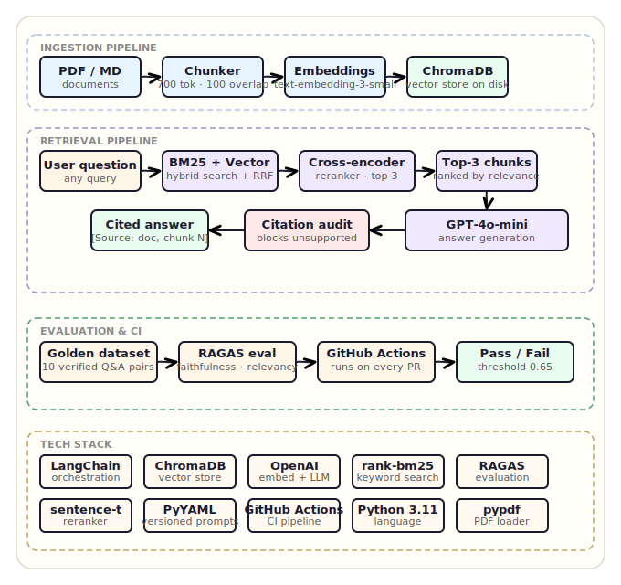

# Ask My Doc — RAG System

A production-grade Retrieval Augmented Generation (RAG) system built in Python.
Upload your documents and ask questions — the system retrieves the most relevant
content and answers with inline citations, refusing to guess when the answer
isn't in the documents.

---

## Why this matters

Most RAG demos hallucinate confidently when the answer isn't in the documents.
This system doesn't. Every answer goes through three layers before reaching
the user — hybrid retrieval, reranking, and a citation audit. If any claim
isn't supported by the source chunks, the response is blocked.

On top of that, every pull request automatically triggers a RAGAS evaluation
run. If answer quality drops below the threshold, the build fails. No silent
regressions.

---

## Architecture


```

---

## Tech Stack

| Component | Tool |
|---|---|
| Orchestration | LangChain |
| Vector store | ChromaDB |
| Embeddings | OpenAI text-embedding-3-small |
| LLM | GPT-4o-mini |
| Keyword search | rank-bm25 |
| Reranker | sentence-transformers ms-marco-MiniLM-L-6-v2 |
| Evaluation | RAGAS |
| CI pipeline | GitHub Actions |
| Prompt config | YAML versioned |
| Language | Python 3.11 |

---

## Project Structure
```
rag-system/
├── .github/
│   └── workflows/
│       └── eval.yml                 # CI pipeline — runs on every push
├── src/
│   ├── config.py                    # central config and prompt loader
│   ├── ingestion/
│   │   ├── ingest.py                # document loading and chunking
│   │   ├── vectorstore.py           # embedding and ChromaDB storage
│   │   └── run_ingest.py            # ingestion runner
│   └── retrieval/
│       ├── retriever.py             # Phase 1 semantic search
│       ├── hybrid_retriever.py      # Phase 2 BM25 + vector search with RRF
│       ├── reranker.py              # Phase 2 cross-encoder reranker
│       ├── citation_enforcer.py     # Phase 2 citation audit
│       ├── answer.py                # Phase 1 answer generation
│       └── answer_v2.py             # Phase 2 answer generation
├── eval/
│   ├── golden_dataset.json          # 10 manually verified Q&A pairs
│   ├── run_eval.py                  # RAGAS evaluation script
│   └── eval_results.json            # latest evaluation results
├── prompts/
│   └── prompts.yaml                 # versioned prompt config
├── data/                            # place your documents here
└── tests/
    ├── test_env.py
    ├── test_retrieval.py
    ├── test_answer.py
    ├── test_hybrid.py
    ├── test_reranker.py
    └── test_phase2.py
```

---

## Setup
```bash
python -m venv venv
venv\Scripts\activate        # Windows
pip install -r requirements.txt
cp .env.example .env         # add your OPENAI_API_KEY
```

---

## Usage
```bash
# Ingest a document
python -m src.ingestion.run_ingest data/your_document.pdf

# Run Phase 2 pipeline
python tests/test_phase2.py

# Run RAGAS evaluation
python eval/run_eval.py
```

---

## Example Output
```
Processing: 'What optimizer was used and what were its parameters?'
  Hybrid retrieval: 5 candidates
  After reranking: 3 chunks
    [-3.89] attention_paper_chunk11
    [-9.67] attention_paper_chunk14
    [-10.81] attention_paper_chunk13
  Running citation audit...
  Audit result: supported=True

Q: What optimizer was used and what were its parameters?
A: The optimizer used was Adam with β1=0.9, β2=0.98 and ε=10⁻⁹
   [Source: attention_paper, chunk 1]

Q: What is the capital of France?
A: I cannot answer this from the available documents.
```

---

## Evaluation Results

| Metric | Score | Threshold | Status |
|---|---|---|---|
| Faithfulness | 0.667 | 0.65 | PASSED |
| Answer relevancy | 0.798 | — | — |

Evaluation runs automatically on every push via GitHub Actions.

---

## Phases

### ✅ Phase 1 — Core pipeline (complete)

- Document ingestion: PDF and Markdown
- Chunking: 700 token window, 100 token overlap
- Vector store: ChromaDB with OpenAI embeddings
- Retrieval: Top-K semantic search
- Answer generation: GPT-4o-mini with citation enforcement
- Versioned prompt config

### ✅ Phase 2 — Production quality (complete)

- Hybrid retrieval: BM25 keyword search + vector semantic search
- Reciprocal Rank Fusion (RRF) to merge ranked lists
- Cross-encoder reranker: ms-marco-MiniLM-L-6-v2
- Citation enforcement: LLM audits its own answers, blocks unsupported claims

### ✅ Phase 3 — Evaluation and CI (complete)

- Golden dataset: 10 manually verified Q&A pairs
- RAGAS faithfulness and answer relevancy scoring
- GitHub Actions CI pipeline triggers on every push and PR
- Build fails automatically if faithfulness drops below threshold
